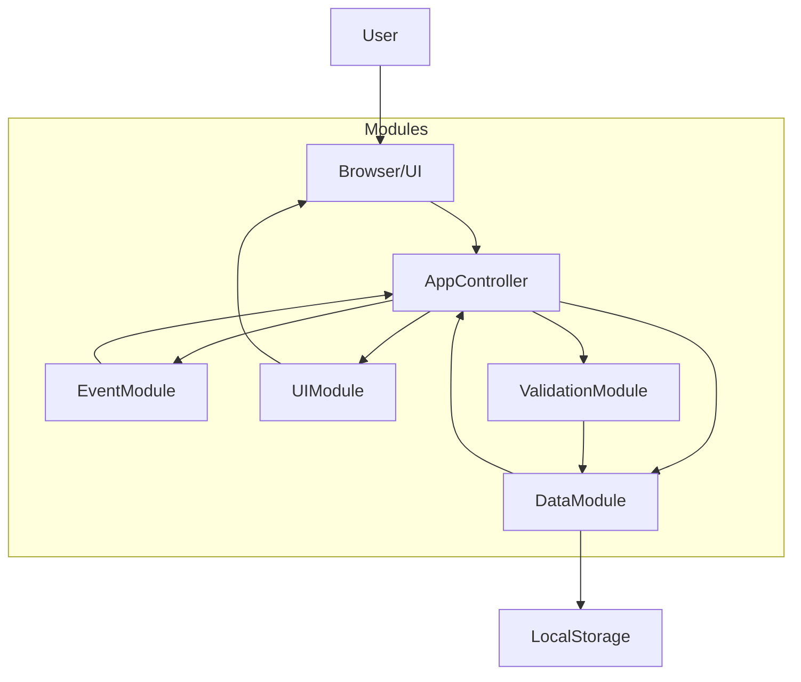
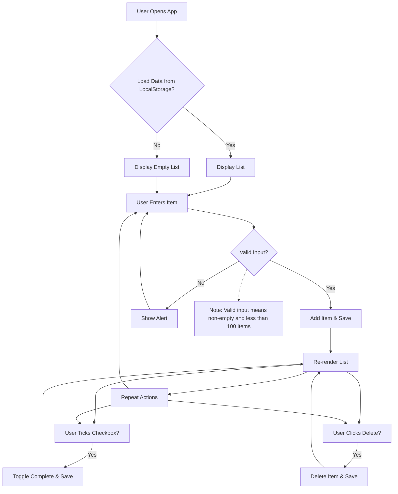
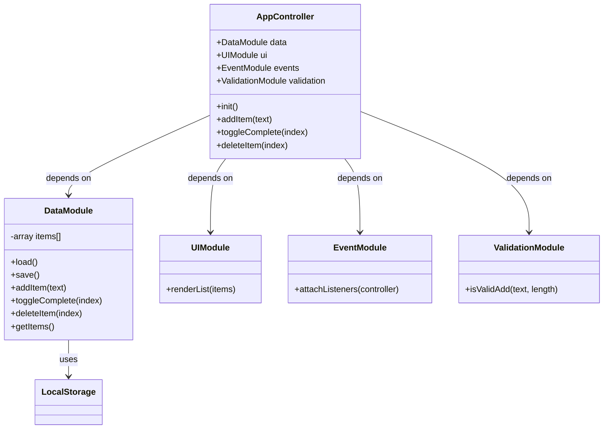
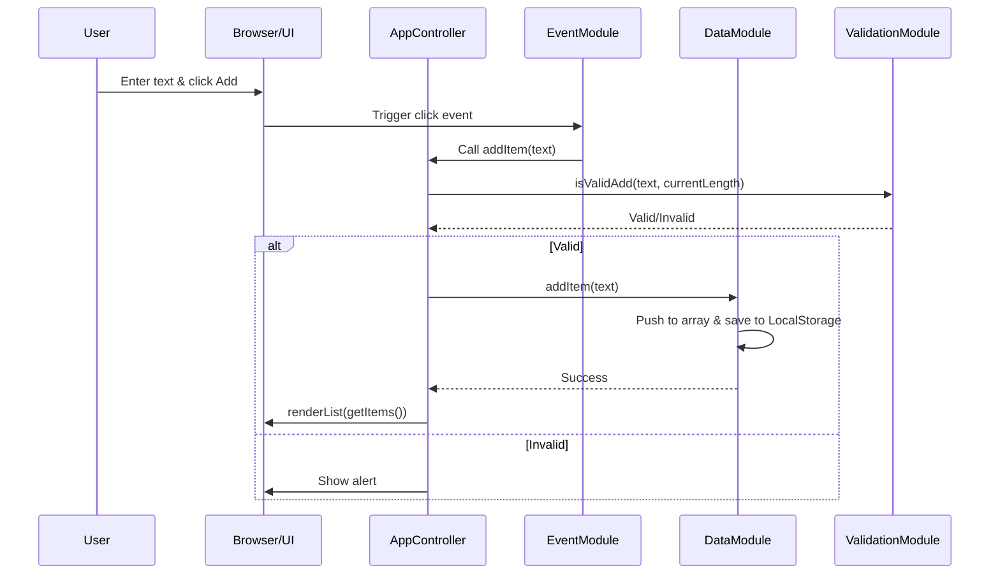
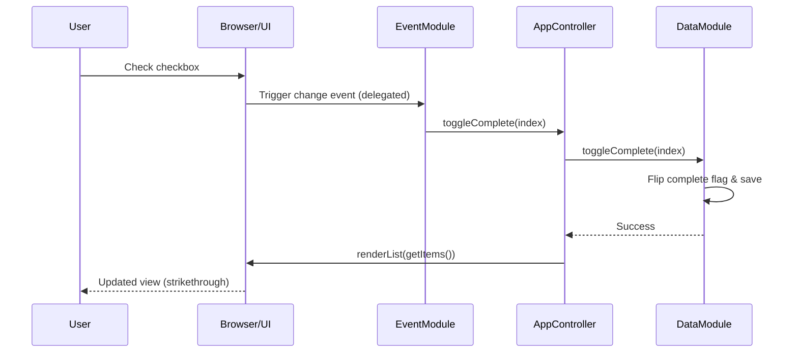
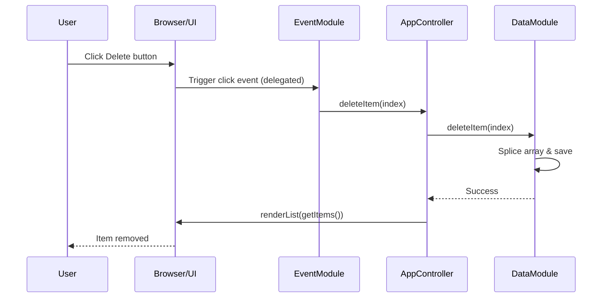
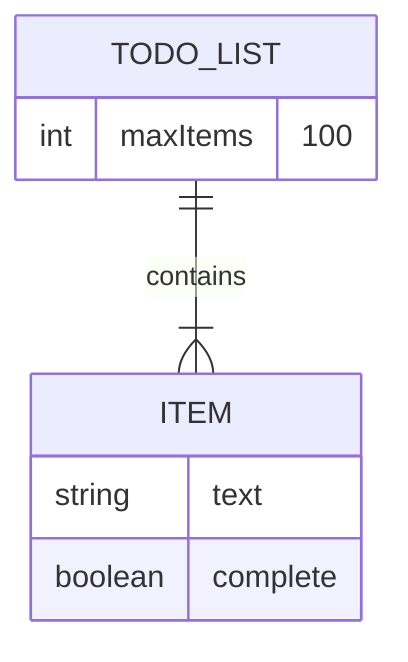
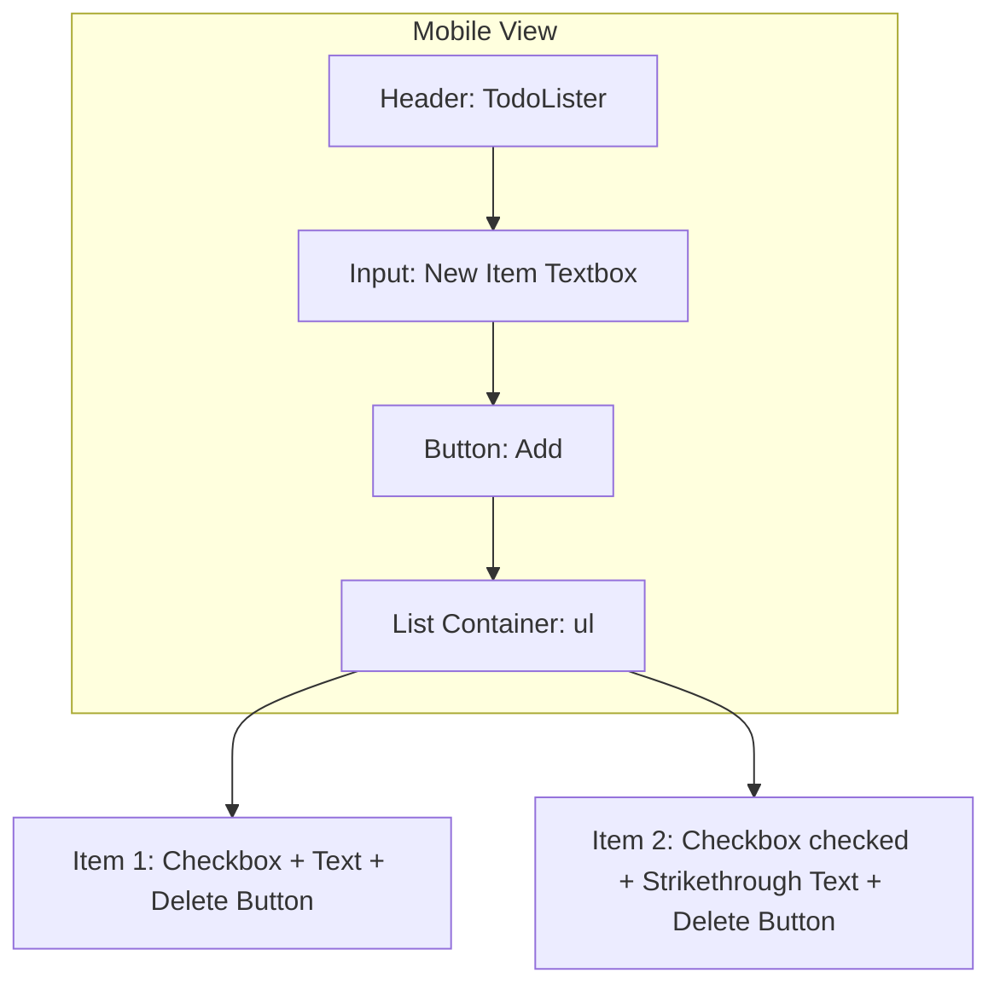
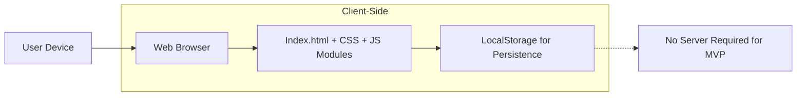
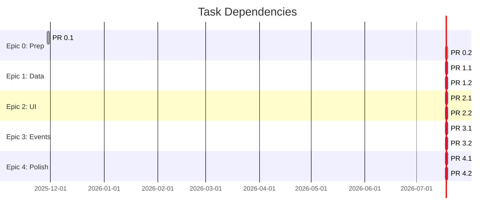

## TodoLister Diagrams

Below is an extensive set of diagrams for the TodoLister project, based on the enhanced PRD and tasklist. These diagrams cover various aspects including user flows, architecture, class structures, sequences, data models, and UI wireframes. I've used Mermaid syntax for rendering, as it's suitable for text-based diagrams and aligns with the project's documentation style. Each diagram is labeled and described for clarity.

### 1. High-Level Architecture Diagram
This diagram illustrates the modular architecture, showing how components interact while adhering to SOLID principles (e.g., dependency inversion via interfaces).

### 2. Detailed User Flow Diagram
An expanded version of the original user flow, including decision points, error handling, and loops for iterative actions.

### 3. Class Diagram (UML Style)
This shows the classes and their relationships, emphasizing modular design with methods and properties. Note: JavaScript doesn't have strict classes, but this represents the structure.

### 4. Sequence Diagram: Adding an Item
This sequence shows the flow for adding a new item, highlighting interactions between modules.

### 5. Sequence Diagram: Ticking Off an Item
This covers the toggle complete action, with event delegation.

### 6. Sequence Diagram: Deleting an Item
This illustrates the delete flow.

### 7. Data Model Diagram
A simple entity diagram for the item structure stored in the array.

### 8. UI Wireframe: Main Screen
This is a basic wireframe showing the layout of the app's interface.

### 9. Deployment Diagram
Though simple (client-side only), this shows the runtime environment.

### 10. Task Dependency Diagram
This Gantt-like diagram shows dependencies between epics and PRs from the tasklist.

These diagrams provide comprehensive visual documentation for the project. They can be used for development, onboarding, or extension planning. If you need more details or variations, let me know!
