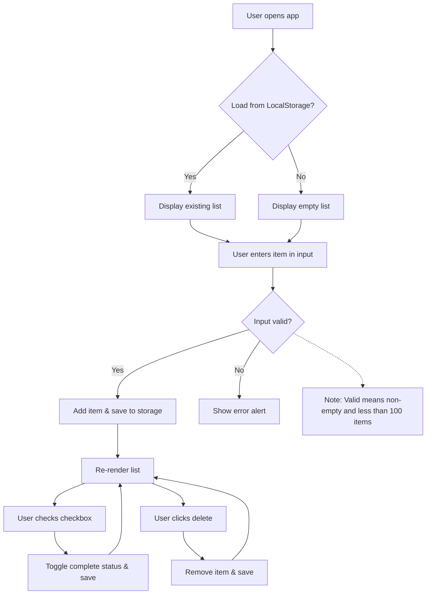

# TodoLister PRD (Enhanced Version)

## Executive Summary
TodoLister is a lightweight, user-friendly web application designed to help individuals manage simple TODO lists, with an initial focus on shopping lists. By providing core functionalities such as adding, marking as complete, and deleting items, it addresses the common pain points of forgetting purchases or managing lists inefficiently during shopping. This MVP aims to deliver a seamless experience within a constrained development timeline (optimized for 1-24 hours), emphasizing reliability, maintainability, and scalability through adherence to SOLID principles and a modular architecture.

The application will be built as a single-page application (SPA) using vanilla HTML, CSS, and JavaScript, ensuring broad compatibility and minimal dependencies. Key benefits include offline capability (via local storage), intuitive UI/UX, and extensibility for future features like multiple lists or sharing. Success will be gauged by user satisfaction in performing core actions and the app's performance under load (e.g., handling 100 items without lag). This PRD breaks down the project into epics, user stories, features, pull requests (PRs), commits, and subtasks to enable efficient implementation by human developers or LLMs.

## Overview
TodoLister enables users to create, update, and manage a single TODO list in real-time. The MVP targets shopping list scenarios but is designed modularly for future expansions (e.g., general TODOs, categories). It prioritizes simplicity, speed, and error-free interactions, ensuring users can focus on their tasks without technical hurdles.

## Problem Statement
Users often struggle with ad-hoc list management using paper notes or generic apps that lack focus on quick shopping workflows. This leads to forgotten items, duplicate purchases, or inefficient deletions. TodoLister solves this by offering a dedicated, browser-based tool for adding items on-the-fly, ticking them off during shopping, and removing unnecessary ones, all within a single, persistent list limited to 100 items for performance.

## Target Audience
- Primary: Everyday shoppers (e.g., busy professionals, parents) seeking a quick, no-frills list manager.
- Secondary: General users needing simple TODO tracking, such as students or hobbyists.
- Demographics: Ages 18-65, tech-savvy enough to use modern browsers, with access to desktops or mobiles.

## Technical Summary
TodoLister will be developed as a client-side SPA to minimize server dependencies and enable offline use. The tech stack includes:
- **Frontend**: HTML5 for structure, CSS3 for responsive styling (using Flexbox or Grid for layout), and vanilla JavaScript (ES6+) for logic and DOM manipulation.
- **Storage**: LocalStorage API for persisting the list across sessions (no backend required for MVP).
- **No external libraries**: To keep it lightweight and dependency-free, avoiding bloat and ensuring fast load times.
- **Build Tools**: None required for MVP; code can be written in a single HTML file with embedded CSS/JS, or split into separate files for modularity.
- **Testing**: Manual unit tests via browser console; optional integration with Jest if time allows (but not in scope for 1-hour build).
- **Deployment**: Hostable on any static server (e.g., GitHub Pages) or run locally.

The architecture follows a modular pattern, separating concerns into distinct modules (e.g., UI rendering, data management, event handling) to facilitate testing, reuse, and extension. Performance targets: Load in <1s, handle 100 items with no visible lag.

## Architecture and Design Principles
To ensure maintainability and scalability, TodoLister adheres to SOLID principles adapted for JavaScript:
- **Single Responsibility Principle (S)**: Each module handles one concern (e.g., DataModule only manages storage, not UI).
- **Open-Closed Principle (O)**: Modules are open for extension (e.g., via hooks or events) but closed for modification (e.g., core list operations can be extended without altering base code).
- **Liskov Substitution Principle (L)**: Not heavily applicable in JS, but ensured by using consistent interfaces (e.g., any storage adapter could replace LocalStorage without breaking code).
- **Interface Segregation Principle (I)**: Small, focused APIs (e.g., separate functions for addItem vs. renderList) to avoid bloated objects.
- **Dependency Inversion Principle (D)**: High-level modules (e.g., AppController) depend on abstractions (e.g., a StorageInterface) rather than concrete implementations.

**Modular Design**:
- **AppController**: Orchestrates modules, handles initialization and event delegation.
- **DataModule**: Manages list data (CRUD operations) and persistence.
- **UIModule**: Handles rendering and DOM updates.
- **EventModule**: Manages user interactions (clicks, inputs).
- **ValidationModule**: Checks constraints (e.g., max 100 items, non-empty inputs).

Modules communicate via events or direct function calls, promoting loose coupling. Code will be organized in separate JS files (if not inlined) for better organization.

## Epics and User Stories
Epics group related user stories for phased development.

### Epic 1: List Management Core
As a user, I want to manage a persistent shopping list so that I can track items reliably.

- User Story 1.1: As a user, I want to add new items to my shopping list so that I can build my list incrementally.
- User Story 1.2: As a user, I want to mark items as purchased (tick off) so that I can track progress.
- User Story 1.3: As a user, I want to delete items from my shopping list so that I can remove unnecessary entries.
- User Story 1.4: As a user, I want the list to persist across browser sessions so that I don't lose data.

### Epic 2: User Interface and Experience
As a user, I want an intuitive interface so that I can interact effortlessly.

- User Story 2.1: As a user, I want to view the current list with clear status indicators (e.g., checkboxes for ticking).
- User Story 2.2: As a user, I want real-time updates after actions (add/tick/delete) without page reloads.
- User Story 2.3: As a user, I want validation for actions (e.g., prevent adding empty items or exceeding 100 items).

### Epic 3: Error Handling and Constraints
As a user, I want the app to handle edge cases gracefully so that it remains reliable.

- User Story 3.1: As a user, I want alerts for constraints (e.g., "Max 100 items reached").
- User Story 3.2: As a user, I want the app to load existing data on startup.

## Features
1. **Add Item**: Input field and button to append new items (text only, no duplicates enforced in MVP).
2. **Tick Off Item**: Checkbox per item to mark as complete (strikethrough styling).
3. **Delete Item**: Button per item to remove it.
4. **List Display**: Unordered list showing items with checkboxes and delete buttons.
5. **Persistence**: Auto-save to LocalStorage after each action.
6. **Validation**: Limit to 100 items; prevent empty additions.
7. **Responsive Design**: Basic mobile-friendly layout.

## User Flow
Expanded from the original, including error paths:

## Breakdown into PRs, Commits, and Subtasks
This breakdown assumes a Git-based workflow. Each PR represents a mergeable unit (e.g., a feature branch). Commits are atomic changes. Subtasks are detailed steps for implementation.

### PR 1: Setup Project Structure and Basic HTML/CSS
- **Branch**: feature/setup
- **Commits**:
  - Commit 1: Initialize repository and add .gitignore.
  - Commit 2: Create index.html with basic structure (header, input form, list container).
  - Commit 3: Add styles.css for basic styling (flex layout, buttons, checkboxes).
- **Subtasks**:
  - Create HTML skeleton: <body> with <h1>TodoLister</h1>, <input id="newItem">, <button id="addBtn">Add</button>, <ul id="list"></ul>.
  - Style with CSS: Use :root for variables, .complete for strikethrough.
  - Test: Open in browser; ensure layout is responsive (media queries for mobile).

### PR 2: Implement DataModule and Persistence (Epic 1, Stories 1.4, 3.2)
- **Branch**: feature/data-module
- **Commits**:
  - Commit 1: Create data.js with DataModule class (init, load, save methods using LocalStorage).
  - Commit 2: Add CRUD methods: addItem, toggleComplete, deleteItem.
  - Commit 3: Implement validation (e.g., check length <100).
- **Subtasks**:
  - Define DataModule: Use an array for items [{text: string, complete: boolean}].
  - load(): Parse JSON from LocalStorage or init empty array.
  - save(): Stringify and store.
  - addItem(text): If text.trim() && length <100, push and save.
  - toggleComplete(index): Flip complete flag and save.
  - deleteItem(index): Splice and save.
  - Test: Console.log outputs; simulate in browser.

### PR 3: Implement UIModule and Rendering (Epic 2, Stories 2.1, 2.2)
- **Branch**: feature/ui-module
- **Commits**:
  - Commit 1: Create ui.js with UIModule class (renderList method).
  - Commit 2: Generate list items: For each item, create <li> with <input type="checkbox">, , <button>Delete</button>.
  - Commit 3: Add styling hooks (e.g., checked => .complete class).
- **Subtasks**:
  - renderList(items): Clear <ul>, loop to append <li> elements.
  - Apply styles: Checkbox onchange to call toggle, delete onclick to call delete.
  - Ensure real-time: Call render after data changes.
  - Test: Manually add mock data and verify DOM updates.

### PR 4: Implement EventModule and AppController (Epics 1-3, Remaining Stories)
- **Branch**: feature/event-app
- **Commits**:
  - Commit 1: Create events.js with EventModule (attachListeners).
  - Commit 2: Create app.js with AppController: Init modules, wire them together.
  - Commit 3: Handle add button click: Get input, call data.addItem, then ui.renderList.
  - Commit 4: Attach dynamic listeners for checkboxes and deletes (event delegation on <ul>).
  - Commit 5: Add error handling (alerts for validation failures).
- **Subtasks**:
  - AppController.init(): Create instances of DataModule, UIModule, EventModule; load data; render initial list; attach events.
  - EventModule: addBtn.onclick => add logic; ul.onclick => if target is delete, get index and call delete; ul.onchange => if checkbox, get index and toggle.
  - Use event delegation for efficiency (e.g., event.target.closest('li')).
  - Test: Full e2e in browser; add/tick/delete cycle.

### PR 5: Polish, Testing, and Documentation
- **Branch**: feature/polish
- **Commits**:
  - Commit 1: Add README.md with setup instructions.
  - Commit 2: Fix any bugs (e.g., index calculation in events).
  - Commit 3: Optimize for performance (debounce if needed, but unlikely for MVP).
- **Subtasks**:
  - Write inline comments in code for clarity.
  - Test edge cases: 100 items, empty input, delete last item.
  - Ensure SOLID: Refactor if any module violates (e.g., move validation to ValidationModule if complex).

## Assumptions & Constraints
- Browser: Modern (Chrome, Firefox, Safari; ES6 support).
- Internet: Not required post-load (LocalStorage works offline).
- Time: Optimized for 1-hour build (core in one file); full modular in 24 hours.
- Scope: No auth, sharing, or backend; max 100 items enforced.
- Accessibility: Basic (aria-labels optional for MVP).

## Success Metrics
- **Functional**: 100% coverage of user stories (add/tick/delete up to 100 items).
- **Performance**: No lag with 100 items; load time <1s.
- **Usability**: Intuitive flow; no crashes on actions.
- **Maintainability**: Code passes SOLID review; easy to add features (e.g., sort in future).
